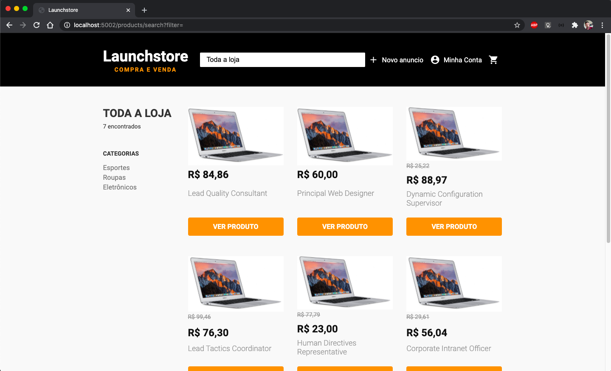
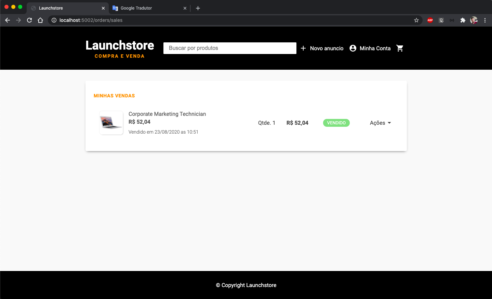

<h1 align="center">Launchstore</h1>

<h1>
  
</h1>

## Indice
<p>
  <p>- <a href="#bookmark-sobre">Sobre</a></p>
  <p>- <a href="#camera-galeria-de-fotos">Galeria de fotos</a></p> 
  <p>- <a href="#computer-tecnologias-utilizadas">Tecnologias</a></p>
  <p>- <a href="#dart-objetivo">Objetivo</a></p>
  <p>- <a href="#package-como-baixar-o-projeto">Baixar</a></p>
  <p>- <a href="#gear-requisitos">Requisitos</a></p>
  <p>- <a href="#bust_in_silhouette-autor">Autor</a></p>
  <p>- <a href="#pencil-licença">Licença</a></p>
</p>

<h1></h1>

## :bookmark: Sobre
Plataforma de compra e venda de produtos.</br>
Conta com gerenciamento de até 6 imagens por produto.</br>
Bloqueio de rotas por usuário logado.</br>
Gerenciamento das compras e vendas.<br>

## :camera: Galeria de fotos

Home                       |  Novo produto             |  Anúncios do vendedor
:-------------------------:|:-------------------------:|:-------------------------:
  |    |  

Pesquisa de produtos       |  Detalhes do produto      |  Carrinho de compras
:-------------------------:|:-------------------------:|:-------------------------:
  |    |  

Conta de usuário           |  Meus pedidos             |  Minhas vendas
:-------------------------:|:-------------------------:|:-------------------------:
  |    |  

## :computer: Tecnologias Utilizadas
Front-End:
- HTML
- CSS
- Nunjucks
- JavaScript
- Lottie

Back-End:
- NodeJS
- Express
- Method Override
- Multer
- bcryptjs
- express-session
- nodemailer
- Faker (Criação de dados fakes para testes)

Banco de dados:
- PostgreSQL

## :dart: Objetivo
Plataforma tem como objetivo disponibilizar:
- Compra e venda de produtos
- Gerenciamento de pedidos de compra e venda
- Cadastro, visualização, edição e exclsão de usuários
- Cadastro, Visualização, edição e exclusão de produtos
- Controle de sessão de usuário
- Bloqueio de rotas caso usuário não logado
- Envio de e-mails para recuperação de senha e compra de produtos

## :package: Como baixar o projeto
Pelo seu terminal, escolha um local para o projeto e rode os comandos:
```bash
  # Clonar o repositório
  $ git clone https://github.com/luizcampos331/launchstore.git

  # Entrar no diretório
  $ cd launchstore

  # Instalar dependências
  $ npm install

```

## :gear: Requisitos:
- Editor de códido (recomendo o Visual Studio Code: https://code.visualstudio.com/)
- Node JS (https://nodejs.org/en/)
- PostgreSQL (https://www.postgresql.org/)

Obs: utilize o conteúdo do arquivo <a href="launchstore_db.sql">launchstore_db.sql</a> para a criação do banco de dados. Após a criação do banco de dados, crie dados fakes para testar a aplicação com o comando no terminal:
```bash
  $ node seed.js
```

## :bust_in_silhouette: Autor:
Luiz Eduardo Campos da Silva</br>
LinkedIn: <a href="https://www.linkedin.com/in/luiz-campos">@luiz-campos</a></br>
Github: <a href="https://www.github.com/luizcampos331">@luizcampos331</a>

## :pencil: Licença
Copyright © 2020 <a href="https://www.github.com/luizcampos331">Luiz Campos</a></br>
Este projeto é licenciado pelo <a href="LICENSE">MIT</a>
